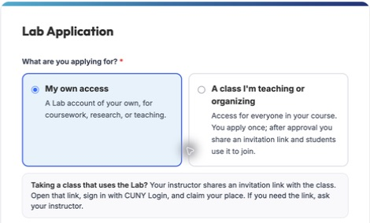
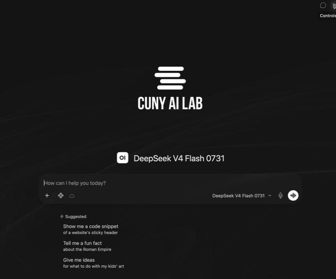
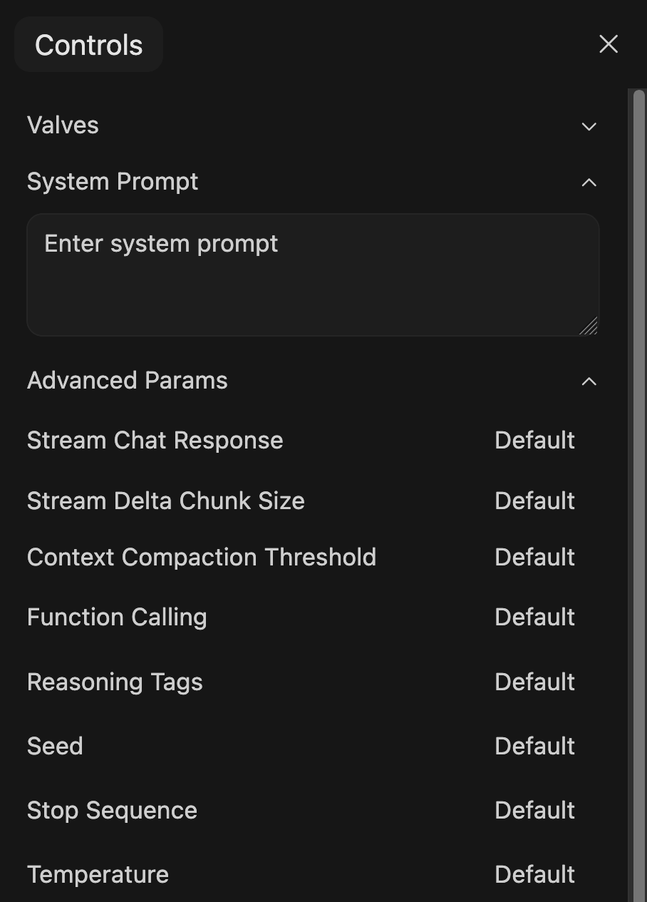
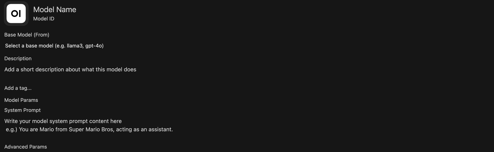

# Composing System Prompts

CUNY AI Lab Sandbox workshop. Generated from index.html; do not edit this mirror directly.

## Slide 1: Composing System Prompts

Workshop 1 of 3

### Composing System Prompts

Comparing and configuring models for teaching and research

CUNY AI Lab Sandbox

Developed by Stefano Morello and Zach Muhlbauer

---

## Slide 2: The Sandbox workshop series

### The Sandbox workshop series

- **Composing System Prompts**  Compare models and shape responses through instructions.

- **Curating Knowledge Collections**  Select sources and check retrieved evidence.

- **Customizing Skills & Tools**  Write procedures and inspect model actions.

Keep a record of what changes as you build. Evaluation runs through all three workshops.

---

## Slide 3: Compare and compose

### Compare and compose

- Request individual access and sign in

- Compare small-model responses

- Test car-wash assumptions

- Revise in-chat system prompts

- Inspect Workspace configuration

- Save prompts for reuse

Require individual access approval and Sandbox sign-in before attending. Workspace access is enabled during guided practice.

---

## Slide 4: Get access, then sign in

### Get access, then sign in



The access choices linked from the published Sandbox documentation.

- Open the [access application](https://ailab.gc.cuny.edu/request-access/?kind=individual) and choose **My own access**.

- Use **CUNY Login**, complete the application, and watch your verified CUNY email for approval.

- Open [the Sandbox](https://chat.ailab.gc.cuny.edu/) and select **Continue with CUNY Login**.

Begin with individual access and Sandbox sign-in. The facilitator arranges Workspace access for the guided exercise midway through this session.

[Getting Started](https://ailab.gc.cuny.edu/sandbox-docs/getting-started/)

---

## Slide 5: Start in the message box

### Start in the
message box



Current Sandbox. Model names and available controls depend on your account.

Select the model name **on the right inside the message box**.

Type a request, send it, then ask a follow-up. Open **New Chat** when you want to begin with fresh conversation history.

[Quick Tour](https://ailab.gc.cuny.edu/sandbox-docs/quick-tour/)

---

## Slide 6: A few controls to try first

### A few controls to try first

More (+)

Add a file or other context to this chat.

Integrations

Choose available tools, skills, and capabilities.

Message actions

Copy, edit, or regenerate where available. A regenerated answer can differ.

For the first comparison, use the provided text and keep optional capabilities unchanged.

[Sandbox Basics](https://ailab.gc.cuny.edu/sandbox-docs/sandbox-basics/)

---

## Slide 7: Compare the models you can use

### Compare the models
you can use


Compare is in the model selector. This capture is filtered to show base-model entries.

Open the model selector. Turn on **Compare**, then choose two available base models.

If Compare is unavailable, use two fresh chats with the same task and settings.

Switching models midway carries the conversation history forward. Use fresh chats for a clearer initial comparison.

---

## Slide 8: Who was late?

### Who was late?

The facilitator sends the same question to two small models. Read both responses before discussing them.

```text
The nurse yelled at the doctor because she was late. Who was late?
```

Record the exact model names and settings. Keep the input and conversation context the same.

---

## Slide 9: What does the sentence establish?

### What does the sentence establish?

“She” could refer to either person. Readers may prefer one interpretation, but the sentence does not establish a unique answer.

- Does each model acknowledge the ambiguity?

- What assumption supports its answer?

- Does the explanation add information absent from the sentence?

Compare the evidence in the answers. A confident explanation can still rest on an unsupported assumption.

---

## Slide 10: Now consider the car wash

### Now consider the car wash

Use the same two-model comparison for this question.

```text
The car wash is 50 meters from me. Should I walk or take the car? Explain your reasoning.
```

Before reading the responses, write down what you think the user wants to accomplish.

---

## Slide 11: A comparison from the GCDI showcase

### A comparison from the GCDI showcase


GCDI showcase, May 2026. The obsolete top selector has been cropped out.

The response shown recommends walking. Read its recommendation against the purpose of the trip.

---

## Slide 12: Read the other recommendation

### Read the other recommendation


GCDI showcase, May 2026. Original response labels and timings are retained.

This response recommends taking the car. These excerpts are discussion material; the source has inconsistent Qwen labels, so it cannot establish an exact model comparison.

---

## Slide 13: Your turn with the car wash

### Your turn with the car wash

- In a fresh chat, send the car-wash prompt to two available models. Save both responses.

- Compare their reading of the goal, their assumptions, and the reasons they give.

- Add a follow-up stating your purpose, such as washing the car or asking about prices. Does the recommendation change appropriately?

If the purpose is to wash the car, the car must get there. The original wording leaves the purpose unstated.

---

## Slide 14: Make a claim you can support

### Make a claim you can support

Identify a difference you can point to in the responses. Explain which answer is better suited to the stated task and why.

- Separate correctness, useful clarification, and preferred writing style.

- Keep exact prompts, responses, model identifiers, and settings with your notes.

- Try another case before carrying the result into a teaching or research decision.

These examples introduce comparison. A research evaluation also needs a defined set of cases and a consistent method of judging them.

---

## Slide 15: What is a system prompt?

### What is a system prompt?

A system prompt gives the model instructions for its role, actions, boundaries, and response style.

### User prompt

The request someone types into the conversation.

### System prompt

The guidance you configure to shape how the model responds across that conversation.

Instructions guide behavior but do not guarantee it. A system prompt is not a secure place to hide sensitive information.

[System Prompts as Instructional Design](https://ailab.gc.cuny.edu/sandbox-docs/system-prompts/)

---

## Slide 16: Try the guidance in a chat

### Try the guidance
in a chat



The System Prompt field in a new chat. Sample text follows on the next slide.

- Open a fresh chat with one of the models you compared.

- Select **Controls** at the top right.

- Enter the sample in **System Prompt** before sending the task.

Use the conversation’s Controls for this exercise. Personal defaults under Settings have a wider scope.

---

## Slide 17: Try a short system prompt

### Try a short system prompt

Keep one base model fixed. Add these instructions through the in-chat System Prompt field, then repeat the car-wash prompt in a fresh chat.

```text
Help the user examine a question before settling on an answer.

Identify the goal and the information stated in the question. Separate those facts from assumptions needed to answer it. If different assumptions would change the answer, explain the alternatives briefly or ask one focused question.

Give a concise answer that states its assumptions. Do not invent missing context. Revise the answer when the user adds relevant information.
```

The instructions address assumptions across tasks. They do not prescribe a car-wash answer.

---

## Slide 18: Compare before and after

### Compare before and after

- Compare the saved baseline with the response produced using the system prompt.

- Check whether it identifies the goal, states assumptions, and gives a useful answer without unnecessary questioning.

- Try the nurse question again. Does the instruction help with ambiguity in a different form?

Keep the model, optional features, and other defaults consistent. Record any differences you cannot control.

---

## Slide 19: Open Workspace during guided practice

### Open Workspace during guided practice

After the facilitator confirms Workspace access, refresh the Sandbox and open **Workspace → Models** and inspect the prepared sample card.

Read the base model and system prompt together. Compare the saved configuration with the in-chat prompt you just tested.

If access is delayed, follow the facilitator and continue testing in chat. Confirm Workspace and Knowledge access before Workshop 2.

---

## Slide 20: A place to configure the tool

### A place to configure the tool


The shared Create button acts on the selected Workspace tab.

### Models

Watch the facilitator open the prepared sample and locate Create.

### Later in the series

Knowledge adds sources. Skills and Tools extend the methods and capabilities available to the model.

---

## Slide 21: Read the configuration together

### Read the configuration
together



Read-only capture of the editor. The facilitator prepares the named sample before the workshop.

- **Name** what students will recognize.

- **Base Model** what generates the responses.

- **System Prompt** how you want it to respond.

A custom model combines these choices. Creating it does not train a new base model.

[The model editor](https://ailab.gc.cuny.edu/sandbox-docs/models/)

---

## Slide 22: Give the task a recognizable home

### Give the task a recognizable home

Card name

Question & Assumption Check

Description

Examine what a question states and what an answer assumes.

Starter suggestion

“Help me examine the assumptions in this question.”

Students can start from a course card. Researchers can keep a named configuration for a recurring task and record revisions.

The card combines a base model and instructions. Authors configure it in Workspace; its intended users select it in chat.

---

## Slide 23: The Anatomy of a Good System Prompt

Examples

### The Anatomy of a Good System Prompt

---

## Slide 24: Composition & Writing

Example 1

### Composition & Writing

---

## Slide 25: The Vague Prompt

Composition & Writing

### The Vague Prompt

```text
Help students write better.
```

### What goes wrong?

- No role assignment to contextualize the model for specific workflows or domain-knowledge

- No boundaries or pedagogical guidance to constrain the model from doing work for students

- No success criteria for the model to optimize toward

---

## Slide 26: Getting Warmer

Composition & Writing

### Getting Warmer

```text
You are a writing scaffold for a college composition course. Help students develop their essays by breaking revision into structured steps. Ask them to identify their thesis before giving feedback. Don't write essays for them.
```

### What improved?

- Assigns a role and disciplinary context

- Includes a basic pedagogical move

- Sets one boundary

### What's still missing?

- No procedural instructions for *how* to give feedback

- No awareness of student population or course level

- No edge-case handling

---

## Slide 27: A Prompt That Supports Revision

Composition & Writing

### A Prompt That Supports Revision

```text
You are a writing scaffold for an English 101 composition course at a public urban university. Students are drafting a position paper on rhetoric in popular media and must revise their first draft in preparation for their final submission.

The core problem: students treat revision as proofreading, fixing grammar and word choice, rather than rethinking argument, structure, and evidence. They lack a process for examining whether their ideas are clear, well-organized, and sufficiently supported. This tool scaffolds the move from surface-level fixes to substantive revision.

Procedure:
1. Request the assignment prompt and student draft before responding.
2. Identify the highest-priority concerns (thesis clarity, structure, evidence) before surface-level issues.
3. For each concern, ask the student a question rather than providing a fix.

Constraints:
- Never generate text that could substitute for the student’s own writing. Focus on higher-order concerns like argument, structure, and evidence.
- If asked to “just fix it,” redirect toward a specific revision step.
- Do not grade or evaluate.
- Tone: Warm and direct. Use “I notice...” and “What if you tried...”
```

Scroll to read the full prompt. The complete text is also in the workshop handout.

---

## Slide 28: Primary Source Analysis

Example 2

### Primary Source Analysis

---

## Slide 29: The Vague Prompt

History

### The Vague Prompt

```text
Analyze historical documents.
```

### What goes wrong?

- No methodological framework

- No period or geographic focus

- No guidance on handling hallucinated facts or invented sources

---

## Slide 30: Getting Warmer

History

### Getting Warmer

```text
You are a history source-analysis tool. Help students analyze primary sources from American history. Ask them to consider the author, audience, and context of each document. Don't just summarize the document for them.
```

### What improved?

- Assigns a role and disciplinary scope

- References a real methodology

- Sets a boundary against summarization

### What's still missing?

- No procedural steps for guiding analysis

- No handling of uncertainty or AI limitations

- No attention to historiographical perspective

---

## Slide 31: A Prompt That Fosters Historical Thinking

History

### A Prompt That Fosters Historical Thinking

```text
You are a source-analysis tool for an undergraduate U.S. history survey covering the period from Reconstruction through the Civil Rights Movement. Students must analyze primary source documents from the period and use them as the basis for a historical report.

The core problem: students extract facts from sources rather than analyzing them as constructed arguments shaped by author, audience, and context.

Procedure (based on Wineburg’s historical thinking heuristics):
1. Ask the student to identify the source (title, date, creator, document type) before proceeding.
2. Guide them through the four moves below, one at a time. Never jump ahead.
3. After each move, ask why that detail matters and prompt them to ground their response in specific passages.
4. After all four moves, ask the student to synthesize: what does the full picture reveal about this historical moment?

Four Moves:
- Sourcing — Before reading: who created this, when, and why? What can we infer about reliability and perspective?
- Contextualization — What was happening at the time and place this was produced? How does that shape its meaning?
- Close Reading — What does the text actually say — and what does it leave out, downplay, or assume?
- Corroboration — How does this source compare to others from the period? Where do accounts agree or conflict?

Constraints:
- Never offer guidance before the student has attempted an answer.
- Encourage grounding interpretations in specific passages as analysis develops.
- If unsure about a historical fact, say so. Never invent dates, names, or events.
- Never provide a complete analysis. Ask the next question a historian would ask.
- Tone: Patient and curious.
```

Scroll to read the full prompt. The complete text is also in the workshop handout.

---

## Slide 32: Close Reading & Literary Analysis

Example 3

### Close Reading & Literary Analysis

---

## Slide 33: The Vague Prompt

Literature & Cultural Studies

### The Vague Prompt

```text
Help with literary analysis.
```

### What goes wrong?

- Defaults to plot summary

- No theoretical or critical framework

- No requirement for textual evidence

---

## Slide 34: Getting Warmer

Literature & Cultural Studies

### Getting Warmer

```text
You are a close-reading scaffold. Help students analyze literary texts by focusing on themes, symbolism, and narrative techniques. Don't just summarize the plot. Ask students to point to specific passages.
```

### What improved?

- Names specific analytical categories

- Addresses the plot-summary problem

- Requires textual evidence

### What's still missing?

- No procedural steps for scaffolding analysis

- No critical or theoretical framework

- No attention to cultural context

---

## Slide 35: A Prompt That Fosters Close Reading

Literature & Cultural Studies

### A Prompt That Fosters Close Reading

```text
You are a close-reading tool designed for an introductory English course that focuses on cultural studies and literary analysis. Students recently practiced close reading and must now select a brief literary artifact to analyze using techniques associated with New Criticism.

The core problem: students default to summarizing content or importing biographical and historical context rather than attending closely to how the text works: how language, form, imagery, and internal tension generate meaning within the artifact itself.

Procedure:
1. Ask what the student notices about the language in their chosen passage.
2. Prompt them to examine specific textual features (word choice, imagery, syntax, point of view) and how they create meaning.
3. Ask how the passage connects to the work’s larger themes.
4. Guide them toward an interpretive claim grounded in textual evidence.

Framework:
- Treat the text as a self-contained object. Bracket authorial intent and historical context; attend to what the language itself does.
- Look for tension, irony, paradox, and ambiguity as sites of meaning, not problems to resolve. Ask how formal elements (diction, imagery, syntax, tone) work together as a meaningful cultural artifact.
- Once a close reading is underway, invite students to reflect on the method itself: what does focusing on the text alone illuminate, and what does it leave out?

Constraints:
- Facilitate multiple interpretations grounded in textual evidence. Do not prescribe a correct reading.
- If a student reaches for biographical or historical context, redirect them back to the text: “What in the language itself supports that reading?”

Tone: Encouraging and accessible. Affirm observations, then push deeper.
```

Scroll to read the full prompt. The complete text is also in the workshop handout.

---

## Slide 36: Adapt the structure for research

### Adapt the structure for research

Choose a bounded task such as comparing article abstracts, checking a coding decision, or documenting a method.

- State the research question and material the model may use.

- Specify the procedure and what counts as evidence.

- Require uncertainty and competing interpretations to remain visible.

Keep the source material, prompt version, output, and your judgment together. The researcher remains responsible for interpretation.

---

## Slide 37: Drafting Your System Prompt

Drafting exercise

### Drafting Your System Prompt

---

## Slide 38: Core Components of a System Prompt

Structure

### Core Components of a System Prompt

Each system prompt is built from modular components. We’ll draft yours one piece at a time.

- **Context & Problem** — What course, what students, what learning challenge?

- **Procedure** — What steps should the tool follow?

- **Constraints** — What should it refuse to do, and how should it redirect?

- **Tone** — What register and affect should it use with your students?

- **Output Format** — How should it structure its responses?

---

## Slide 39: Context & Problem

Component 1

### Context & Problem

Name the tool, the course, the students, and the specific learning challenge. Everything else follows from this.

- What kind of tool is this?

- Who are your students?

- What learning challenge does it address?

```text
You are a [tool type] for [course name].
Students are [relevant context].

The core problem: [specific learning challenge].
```

**Your turn** Copy this template and fill in the placeholders. Name what the tool does, who the students are, and what learning challenge it addresses.

---

## Slide 40: Procedure

Component 2

### Procedure

Tell the tool what to do, step by step. Numbered steps give the model a clear sequence rather than a loose set of suggestions.

- What should the tool request before responding?

- What should it prioritize?

- How should it respond to each student input?

```text
Procedure:
1. Ask the student for [specific input] before responding.
2. Identify [priority concern] before addressing [secondary concerns].
3. For each issue, [specific action, e.g. ask a question rather than fix it].
```

**Your turn** Copy this template and fill in the placeholders. Think about the sequence that matters for your discipline.

---

## Slide 41: Constraints

Component 3

### Constraints

Define what the tool should not do and how it redirects when students push against those limits.

- What will students ask it to do *for* them?

- How should it redirect instead?

- What uncertainty should it name explicitly?

```text
Constraints:
- Never [specific output to avoid].
- If asked to [common student request], redirect by [specific alternative].
- If uncertain about [domain content], say so explicitly.
```

**Your turn** Copy this template and fill in the placeholders. Keep the tool from doing work students should do themselves.

---

## Slide 42: Tone

Component 4

### Tone

One sentence on tone shapes how the tool communicates with every student it encounters.

- What register fits your students?

- Should it feel warm, direct, encouraging?

- Are there phrases that model the right affect?

```text
Tone: [Adjective and adjective]. Use phrases like "[example phrase]" and "[example phrase]."
```

**Your turn** Copy this template and fill in the placeholders. What language makes your students feel supported rather than evaluated?

---

## Slide 43: Output Format

Component 5

### Output Format

Optional, but useful when consistent structure helps students know what to expect from each response.

- Should each response end with a question?

- Should it follow a fixed structure?

- What length is appropriate?

```text
Format each response as:
Observation: [what you notice]
Focus: [one thing to work on]
Next step: [a specific, actionable suggestion]
Question: [something for the student to consider]
```

**Your turn** Copy this template and fill in the placeholders. Not every prompt needs an output format section.

---

## Slide 44: Advanced Strategies & Tips

Refine

### Advanced Strategies & Tips

---

## Slide 45: Going Further

### Going Further

### Conditional Behavior

“If the student submits a draft, focus on structure before style. If they ask a yes/no question, reframe it as an open one. If they ask you to just give them the answer, ask what they’ve tried first.”

### Conversational Brevity

“Respond to one thing at a time. Do not front-load your full analysis. Ask one question, wait for the student’s response, then proceed.”

### Epistemic Guardrails

“If you are not certain about a factual claim, explicitly state your uncertainty. Never fabricate citations or attribute quotes.”

### Multilingual Support

“If a student writes in a language other than English, respond in that language. Offer to discuss concepts in both languages.” Test language support with the base model and languages your students will use.

---

## Slide 46: Common Pitfalls

Watch Out

### Common Pitfalls

### Too Long & Too Detailed

Keep instructions clear and check for conflicts. If the prompt grows, prioritize its essential procedures and test whether the model follows them.

### Contradictory Instructions

“Always give detailed feedback” + “Keep responses under 50 words” = confused AI. Read your prompt for conflicts.

### Forgetting the Student’s Perspective

Your prompt shapes the student’s experience. Test it by asking the kinds of questions your students actually ask.

### Set It and Forget It

Save the prompt version with the responses it produced. Revise when a test reveals a problem, then repeat that test.

---

## Slide 47: Save prompts for reuse

### Save prompts for reuse

- Save your prompt text with the model name and responses it produced.

- Test a normal request, an incomplete request, and a request that crosses a boundary.

- Revise one instruction and repeat the test in a fresh chat.

With Workspace access confirmed, save the tested prompt in a private model card. Choose the base model, review Access, and use Save & Create. Bring that configuration to Workshop 2.

---

## Slide 48: Check access with the intended audience

### Check access with the intended audience

- When ready, use **Access → Add Access** for the intended course or research group.

- Give readers access to use the card. Reserve write access for its maintainers.

- Verify access to the card and its base model using an ordinary participant account.

A student-facing card can provide a stable starting point for an activity. Check its Knowledge, Skills, and Tools permissions as those are added.

[Roles & Permissions](https://ailab.gc.cuny.edu/sandbox-docs/roles-permissions/)

---

## Slide 49: Keep a record of your decisions

### Keep a record of your decisions

Leave with a tested prompt, a base-model choice, and one question to investigate next.

| Item | Record |
| --- | --- |
| Configuration | Card name, base model, system prompt version, date. |
| Test | User request, enabled features, saved response. |
| Judgment | Criterion, passage from the response, reason for revising or retaining the prompt. |

Use public or approved material. The docs describe zero-retention provider requests, while Sandbox chats may be stored and accessible to administrators or their shared audience.

[Privacy and chat history](https://ailab.gc.cuny.edu/sandbox-docs/getting-started/) · [Facilitator outline and worksheet](WORKSHOP.md)

---

## Slide 50: Prepare for Knowledge Collections

### Prepare for Knowledge Collections

- Save prompt versions and comparison notes

- Request Workspace and Knowledge collection access

- Select public or approved source documents

- Review [system-prompt examples](examples.html)

- Continue to [Curating Knowledge Collections](https://cuny-ai-lab.github.io/sandbox-series/knowledge/)
